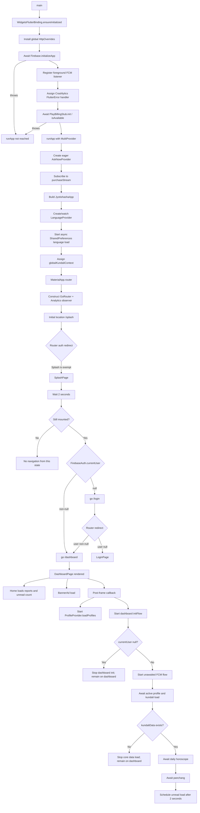

# Enterprise Startup Flow Audit

## Scope and audit boundary

This report traces the executable Flutter path from `lib/main.dart` to the first landing screen: `LoginPage` or `DashboardPage`. It also records work started as part of constructing the dashboard, because that work begins immediately when the dashboard branch is selected. It does not treat commented-out statements as executed code.

Source references use `path:line` and describe the repository state at the time of this audit.

# 1. Startup Execution Order

## Process-level startup

1. The Dart entry point calls `main()` (`lib/main.dart:41`).
2. `WidgetsFlutterBinding.ensureInitialized()` establishes the Flutter binding before plugin calls (`lib/main.dart:42`).
3. `HttpOverrides.global` is replaced with `ForceIPv4` (`lib/main.dart:30-37`, `lib/main.dart:44-45`). Despite the class name and comment, the implementation sets every `HttpClient` proxy result to `DIRECT`; it does not contain an address-family selection call.
4. Firebase is initialized with `DefaultFirebaseOptions.currentPlatform`, and startup awaits completion (`lib/main.dart:48`, `lib/firebase_options.dart`). Nothing after this line runs until the returned future completes successfully.
5. A foreground Firebase Messaging listener is registered on `FirebaseMessaging.onMessage` (`lib/main.dart:50-59`). On a later foreground message, it increments `NotificationProvider` only if `globalKundaliContext` has already been assigned.
6. Flutter framework fatal errors are connected to `FirebaseCrashlytics.instance.recordFlutterFatalError` through `FlutterError.onError` (`lib/main.dart:61`).
7. Google Play Billing availability is probed by awaiting `PlayBillingStub.init()` (`lib/main.dart:63`, `lib/services/play_billing_stub.dart:4-8`). The implementation obtains `InAppPurchase.instance` and awaits `_iap.isAvailable()`; its boolean result is not retained.
8. The ads SDK initialization line is commented out and therefore does **not** execute (`lib/main.dart:65-66`).
9. `runApp()` receives a `MultiProvider` whose child is `JyotishashaApp` (`lib/main.dart:68-98`).

## Provider assembly and root widget construction

10. `MultiProvider` installs factories for 14 `ChangeNotifier` types (`lib/main.dart:69-95`). Provider's default lazy behavior remains in effect for every registration except `AskNowProvider`.
11. `AskNowProvider` is explicitly eager (`lazy: false`). Its instance is created and `initBilling()` subscribes to `InAppPurchase.purchaseStream` (`lib/main.dart:87-94`, `lib/core/state/asknow_provider.dart:55-83`). This is separate from the earlier availability probe.
12. `JyotishashaApp.build()` watches `LanguageProvider.currentLang` (`lib/app/app.dart:16-17`). That first watch causes the lazy language provider to be created; its cascade starts `loadSavedLanguage()` without awaiting it (`lib/main.dart:71-73`).
13. `LanguageProvider` initially exposes `en`, asynchronously opens `SharedPreferences`, reads `app_lang` (falling back to `en`), and calls `notifyListeners()` (`lib/core/state/language_provider.dart:5`, `lib/core/state/language_provider.dart:22-26`). The first app build can therefore use `en` before the stored language is returned.
14. `JyotishashaApp.build()` assigns its provider-aware build context to the mutable global `globalKundaliContext` (`lib/app/app.dart:19`, `lib/core/utils/global_context.dart:3`).
15. The root returns `MaterialApp.router` with the light theme, the current locale, generated application localization support, Flutter localization delegates, and `appRouter` (`lib/app/app.dart:21-41`). A language-provider notification rebuilds this widget with the loaded locale.
16. When `appRouter` is evaluated, the top-level `GoRouter` is constructed with diagnostics, `/splash` as its initial location, and a `FirebaseAnalyticsObserver` using the `analytics` singleton declared in `main.dart` (`lib/app/routes/app_routes.dart:27-31`, `lib/main.dart:39`).

## Routing and first landing

17. The router evaluates its top-level redirect using the synchronous snapshot `FirebaseAuth.instance.currentUser` (`lib/app/routes/app_routes.dart:33-51`). The initial `/splash` location is explicitly exempt from the unauthenticated redirect.
18. `SplashPage` is built for `/splash` (`lib/app/routes/app_routes.dart:68`). Its `initState()` starts `_checkAuthAndNavigate()` (`lib/features/splash/splash_page.dart:15-18`).
19. The splash screen remains visible during a fixed two-second `Future.delayed` (`lib/features/splash/splash_page.dart:20-24`).
20. If the splash state is still mounted, it reads `FirebaseAuth.instance.currentUser` and schedules navigation in a microtask (`lib/features/splash/splash_page.dart:26-40`).
21. The first landing branch is selected:
    - `currentUser == null` -> `context.go('/login')` -> `LoginPage` (`lib/features/splash/splash_page.dart:33-35`, `lib/app/routes/app_routes.dart:70`). The router also permits `/login` for a null user.
    - `currentUser != null` -> `context.go('/dashboard')` -> `DashboardPage` (`lib/features/splash/splash_page.dart:36-38`, `lib/app/routes/app_routes.dart:74`).
    - An exception while reading the auth snapshot or scheduling the microtask inside the surrounding `try` attempts `/login` (`lib/features/splash/splash_page.dart:26-44`). If Firebase still reports a non-null user when that navigation is evaluated, the router's redirect changes the destination to `/dashboard` (`lib/app/routes/app_routes.dart:44-47`). Exceptions thrown later inside the microtask closure are outside that synchronous `try` block.
22. When the login branch constructs `_LoginPageState`, its `AuthService` field is constructed (`lib/features/login/login_page.dart:14-16`). That service captures `FirebaseAuth.instance` and `FirebaseFirestore.instance`; no sign-in or profile read occurs merely by reaching the screen (`lib/services/auth_service.dart:10-12`).

## Work started immediately on the dashboard branch

The dashboard itself can render before the following asynchronous work completes.

23. `DashboardPage` initially selects `DashboardHomeSection` and renders a `BannerAdWidget` (`lib/features/dashboard/dashboard_page.dart:34`, `lib/features/dashboard/dashboard_page.dart:203-209`, `lib/features/dashboard/dashboard_page.dart:254-267`).
24. `DashboardHomeSection.initState()` registers itself as a lifecycle observer, starts loading `assets/data/reports.json`, and starts loading the unread notification count (`lib/features/dashboard/dashboard_home_section.dart:45-53`, `lib/features/dashboard/dashboard_home_section.dart:71-115`). Its unread loader polls every 300 ms until `FirebaseAuth.instance.currentUser` is non-null, then calls `NotificationProvider.loadUnreadCount()`.
25. `BannerAdWidget.initState()` constructs and loads a Google Mobile Ads `BannerAd` (`lib/core/ads/banner_ad_widget.dart:19-40`), although the application-level `MobileAds.instance.initialize()` call in `main.dart` is commented out.
26. After the dashboard's first frame, one guarded post-frame callback starts two unawaited operations in order: `ProfileProvider.loadProfiles()` and `_initFlow()` (`lib/features/dashboard/dashboard_page.dart:39-50`). They run concurrently because neither call is awaited by the callback.
27. `ProfileProvider.loadProfiles()` reads the signed-in user's Firestore profile collection through `ProfileService.getProfiles()` (`lib/core/state/profile_provider.dart:23-54`, `lib/services/profile_service.dart`). If exactly one profile exists and is not active, it marks that profile active and recursively reloads the list.
28. `_initFlow()` takes another `FirebaseAuth.instance.currentUser` snapshot. A null value ends this flow without navigation (`lib/features/dashboard/dashboard_page.dart:55-63`).
29. For a non-null user, `_initFlow()` starts `_printAndSaveFcmToken()` without awaiting it (`lib/features/dashboard/dashboard_page.dart:67-70`). That parallel flow requests notification permission; if authorized, it obtains or regenerates an FCM token, subscribes to `general_0`, updates the Firestore user document, obtains a Firebase ID token, and posts the FCM token to the backend (`lib/features/dashboard/dashboard_page.dart:133-198`).
30. In parallel with the FCM work, `_initFlow()` awaits `_loadAndRefreshAll()` (`lib/features/dashboard/dashboard_page.dart:72-74`). That core sequence is:
    1. Read the current language and create/read `FirebaseKundaliProvider` (`lib/features/dashboard/dashboard_page.dart:95-101`).
    2. Read the user's root Firestore document and its `activeProfileId`.
    3. If an active ID exists, read that profile and POST its normalized birth/location/language payload to `/api/full-kundali-modern` (`lib/core/state/firebase_kundali_provider.dart:45-133`).
    4. If no kundali data is available, stop the core sequence (`lib/features/dashboard/dashboard_page.dart:104-108`). The dashboard remains the selected route.
    5. Otherwise derive the sign and coordinates, then await the daily-horoscope request (`lib/features/dashboard/dashboard_page.dart:110-119`, `lib/core/state/daily_provider.dart:37-74`).
    6. Create/read `PanchangProvider`; its constructor starts a one-minute periodic notifier, then await the panchang request (`lib/core/state/panchang_provider.dart:24-28`, `lib/features/dashboard/dashboard_page.dart:121-127`).
31. Only after `_loadAndRefreshAll()` completes, `_initFlow()` schedules another unread-count load for two seconds later (`lib/features/dashboard/dashboard_page.dart:76-86`). This is additional to the unread load already started by `DashboardHomeSection`.

# 2. Initialization Pipeline

| Initialization | Timing / blocking behavior | Responsible file(s) | Actual behavior |
|---|---|---|---|
| Flutter binding | Before all plugins; blocking/synchronous | `lib/main.dart:42` | Calls `WidgetsFlutterBinding.ensureInitialized()` |
| Global HTTP override | Before Firebase; synchronous | `lib/main.dart:30-45` | Replaces `HttpOverrides.global`; generated clients return `DIRECT` from `findProxy` |
| Firebase Core | Before UI; awaited | `lib/main.dart:48`, `lib/firebase_options.dart` | Initializes the current platform Firebase app |
| Foreground messaging listener | Before UI; subscription registration is synchronous | `lib/main.dart:50-59` | Listens for foreground FCM messages and increments unread state when the global context exists |
| Crashlytics Flutter error handler | Before UI; synchronous assignment | `lib/main.dart:61` | Assigns `FlutterError.onError` to fatal Flutter-error recording |
| Play Billing availability | Before UI; awaited | `lib/main.dart:63`, `lib/services/play_billing_stub.dart` | Calls `InAppPurchase.isAvailable()`; discards the returned availability value |
| Provider registrations | At `runApp` | `lib/main.dart:68-98` | Registers language, profile, kundali, manual kundali, daily, monthly, yearly, panchang, transit, love, notification, cards, and AskNow state |
| AskNow billing listener | During provider-tree build; eager | `lib/main.dart:87-94`, `lib/core/state/asknow_provider.dart:55-83` | Subscribes to the in-app purchase stream; the provider cancels it in `dispose()` |
| Saved language / SharedPreferences | First `JyotishashaApp` build; asynchronous and not awaited | `lib/main.dart:71-73`, `lib/core/state/language_provider.dart:22-26` | Loads `app_lang`, defaults to `en`, then notifies listeners |
| Global provider context | Each `JyotishashaApp.build()`; synchronous | `lib/app/app.dart:19`, `lib/core/utils/global_context.dart` | Stores the current root build context globally |
| Theme | Root app build; synchronous | `lib/app/app.dart:25-26`, `lib/app/theme/app_theme.dart` | Applies `AppTheme.lightTheme` and forces light mode |
| Localization | Root app build; saved value finishes asynchronously | `lib/app/app.dart:17`, `lib/app/app.dart:28-38`, `lib/l10n/app_localizations.dart`, `lib/core/state/language_provider.dart` | Sets locale and delegates from `LanguageProvider`; may initially build in English |
| GoRouter | Root app build; synchronous construction | `lib/app/app.dart:40`, `lib/app/routes/app_routes.dart:27-101` | Configures initial splash route, auth redirect, routes, error page, and analytics observer |
| Firebase Analytics navigation observer | Router construction and later route transitions | `lib/main.dart:39`, `lib/app/routes/app_routes.dart:20-31` | Attaches `FirebaseAnalyticsObserver` to the router |
| Firebase Auth landing check | Router evaluation, then again after the splash delay | `lib/app/routes/app_routes.dart:33-51`, `lib/features/splash/splash_page.dart:20-44` | Reads `FirebaseAuth.instance.currentUser`; no auth stream subscription is configured in the router |
| Login service handles | Login branch construction; synchronous | `lib/features/login/login_page.dart:15`, `lib/services/auth_service.dart:10-12` | Constructs `AuthService` and captures Firebase Auth/Firestore singletons; does not initiate login |
| Dashboard home asset data | Dashboard branch; non-blocking | `lib/features/dashboard/dashboard_home_section.dart:45-53`, `lib/features/dashboard/dashboard_home_section.dart:88-115` | Loads, localizes, shuffles, and selects five entries from `assets/data/reports.json` |
| Dashboard profiles | Post-first-frame; non-blocking relative to route rendering | `lib/features/dashboard/dashboard_page.dart:43-48`, `lib/core/state/profile_provider.dart`, `lib/services/profile_service.dart` | Loads Firestore profiles and may activate the sole profile |
| Dashboard kundali | Post-first-frame; awaited within `_initFlow` | `lib/features/dashboard/dashboard_page.dart:95-108`, `lib/core/state/firebase_kundali_provider.dart` | Reads active profile from Firestore and requests full kundali data from the backend |
| Daily horoscope | After successful kundali; sequentially awaited | `lib/features/dashboard/dashboard_page.dart:110-119`, `lib/core/state/daily_provider.dart` | Requests daily content for the derived sign and current language |
| Panchang | After daily horoscope; sequentially awaited | `lib/features/dashboard/dashboard_page.dart:121-127`, `lib/core/state/panchang_provider.dart` | Starts a provider clock timer on construction and requests panchang data for derived/default coordinates |
| FCM permission/token/topic/persistence | Dashboard post-first-frame; deliberately unawaited by `_initFlow` | `lib/features/dashboard/dashboard_page.dart:67-70`, `lib/features/dashboard/dashboard_page.dart:133-198` | Requests permission, obtains token, subscribes to a topic, writes Firestore, and posts to backend |
| Unread notification count | Dashboard home immediately and again after core data plus a two-second delay | `lib/features/dashboard/dashboard_home_section.dart:71-83`, `lib/features/dashboard/dashboard_page.dart:76-86`, `lib/core/state/notification_provider.dart`, `lib/services/notification_service.dart` | Gets a backend token and requests unread count |
| Banner advertising | Dashboard widget construction | `lib/features/dashboard/dashboard_page.dart:266`, `lib/core/ads/banner_ad_widget.dart` | Calls `BannerAd.load()`; explicit Mobile Ads SDK initialization is absent from the executable startup path |

### Provider creation status at the landing boundary

| Provider | Registration behavior | Created before Login? | Created on Dashboard arrival? | Constructor/startup side effect |
|---|---|---:|---:|---|
| `LanguageProvider` | Lazy factory, then immediately watched by the app | Yes | Yes | Starts unawaited saved-language load |
| `AskNowProvider` | Explicit `lazy: false` | Yes | Yes | Subscribes to purchase stream |
| `ProfileProvider` | Lazy | No | Yes, in post-frame callback | `loadProfiles()` is invoked without awaiting |
| `FirebaseKundaliProvider` | Lazy | No | Yes, in dashboard core load | Firestore and backend load is invoked |
| `DailyProvider` | Lazy | No | Only when kundali data exists | Daily backend request is invoked |
| `PanchangProvider` | Lazy | No | Only after kundali exists and the daily request completes | Constructor starts periodic timer; panchang request follows |
| `NotificationProvider` | Lazy | Only if a foreground message arrives after context assignment | Yes, from dashboard home | Unread backend request is invoked |
| `KundaliProvider` | Lazy | No | Not by the traced initial dashboard path | None in the traced path |
| `ManualKundaliProvider` | Lazy | No | Not by the traced initial dashboard path | None in the traced path |
| `MonthlyProvider` | Lazy | No | Not by the traced initial dashboard path | None in the traced path |
| `YearlyProvider` | Lazy | No | Not by the traced initial dashboard path | None in the traced path |
| `TransitProvider` | Lazy | No | Not by the initial home path | Its constructor would call `fetchTransit()`, but the traced path does not read it |
| `LoveProvider` | Lazy | No | Not by the traced initial dashboard path | None in the traced path |
| `CardsProvider` | Lazy | No | Not while the initial dashboard tab is Home | None in the traced path |

# 3. Startup Decision Tree

## First-launch routing decisions

1. **Did awaited Firebase initialization complete?**
   - Yes: continue.
   - No/throws: `main()` has no enclosing recovery path; `runApp()` is not reached.
2. **Did awaited `PlayBillingStub.init()` complete?**
   - Yes: continue to `runApp()`.
   - No/throws: `main()` has no enclosing recovery path; `runApp()` is not reached.
3. **Initial router location:** always `/splash`.
4. **Router redirect at `/splash`:** allows the route for both authenticated and unauthenticated users.
5. **After two seconds, is the splash state still mounted?**
   - No: the function returns without navigating.
   - Yes: read `FirebaseAuth.instance.currentUser`.
6. **Is `currentUser` null?**
   - Yes: navigate to `/login`; the router permits it; first landing is `LoginPage`.
   - No: navigate to `/dashboard`; first landing is `DashboardPage`.
7. **Did the splash auth/navigation block throw?**
   - It attempts `/login`.
   - The router permits that destination if `currentUser` is null, but redirects it to `/dashboard` if `currentUser` is non-null.

There is **no profile-completeness decision in the cold-start splash/router path**. Any non-null Firebase user is sent to the dashboard, even if `activeProfileId` or its profile document is absent. In that case, dashboard kundali loading returns without data; it does not reroute (`lib/core/state/firebase_kundali_provider.dart:58-82`, `lib/features/dashboard/dashboard_page.dart:104-108`). Although `/onboarding` is registered, startup never selects it (`lib/app/routes/app_routes.dart:69`).

## Router decisions applicable during startup navigation

- Null Firebase user requesting anything except `/login` or `/splash` -> `/login`.
- Non-null Firebase user requesting `/login` -> `/dashboard`.
- All other combinations -> no top-level redirect.
- `/` has its own route-level redirect to `/splash`, after which the same logic applies.

## Post-login branch (not part of the cold-start decision)

Once a user presses the Google login button, `LoginPage` performs a separate profile-existence check. After Google/Firebase authentication it reads `users/{uid}/profiles/default`; an existing document routes to `/dashboard`, while a missing document or Firestore exception routes to `/birth` (`lib/features/login/login_page.dart:21-50`). This decision occurs only after user interaction and does not participate in choosing the initial Login-versus-Dashboard landing.

# 4. Files Participating in Startup

| File | Responsibility |
|---|---|
| `lib/main.dart` | Entry point; Flutter binding, HTTP override, Firebase, foreground messaging, Crashlytics handler, billing availability, provider tree, and `runApp()` |
| `lib/firebase_options.dart` | Supplies platform-specific Firebase options to `Firebase.initializeApp()` |
| `lib/services/play_billing_stub.dart` | Performs the awaited pre-UI in-app-purchase availability probe |
| `lib/app/app.dart` | Builds the root `MaterialApp.router`, consumes language state, configures theme/localization, and stores global context |
| `lib/app/routes/app_routes.dart` | Constructs `GoRouter`, attaches analytics observer, selects initial splash, applies auth redirects, and maps login/dashboard routes |
| `lib/app/theme/app_theme.dart` | Supplies the root light theme |
| `lib/l10n/app_localizations.dart` | Supplies supported locales and generated localization delegate |
| `lib/core/utils/global_context.dart` | Holds the mutable global context used by foreground-message handling |
| `lib/core/state/language_provider.dart` | Loads `app_lang` from SharedPreferences and drives root locale rebuilds |
| `lib/core/state/asknow_provider.dart` | Eagerly subscribes to Google Play purchase updates |
| `lib/core/state/profile_provider.dart` | Registered at root; on dashboard, loads and normalizes profile state |
| `lib/services/profile_service.dart` | Executes dashboard profile queries and sole-profile activation against Firestore |
| `lib/core/state/firebase_kundali_provider.dart` | On dashboard, reads the active Firestore profile and requests full kundali data |
| `lib/core/state/daily_provider.dart` | On dashboard, requests the daily horoscope after kundali succeeds |
| `lib/core/state/panchang_provider.dart` | On dashboard, starts its minute timer when created and requests panchang after daily data |
| `lib/core/state/notification_provider.dart` | Holds unread count; handles foreground increments and dashboard unread loads |
| `lib/services/notification_service.dart` | Retrieves backend token and unread notification count |
| `lib/features/splash/splash_page.dart` | Displays the two-second splash and performs the decisive auth snapshot/navigation |
| `lib/features/login/login_page.dart` | Unauthenticated landing screen; constructs `AuthService`; handles later interactive Google sign-in/profile decision |
| `lib/services/auth_service.dart` | Provides Google/Facebook Firebase authentication and post-login Firestore/backend synchronization; only its construction occurs at the login landing boundary |
| `lib/features/dashboard/dashboard_page.dart` | Authenticated landing screen; starts profile, FCM, kundali, daily, panchang, and delayed notification work |
| `lib/features/dashboard/dashboard_home_section.dart` | Initial dashboard tab; loads report asset, observes lifecycle, and starts an unread-count load |
| `lib/core/ads/banner_ad_widget.dart` | Constructs and loads the banner shown on the initial dashboard tab |
| `lib/core/state/kundali_provider.dart` | Root-registered lazy provider; its factory is not invoked by the traced initial path |
| `lib/core/state/manual_kundali_provider.dart` | Root-registered lazy provider; its factory is not invoked by the traced initial path |
| `lib/core/state/monthly_provider.dart` | Root-registered lazy provider; its factory is not invoked by the traced initial path |
| `lib/core/state/yearly_provider.dart` | Root-registered lazy provider; its factory is not invoked by the traced initial path |
| `lib/core/state/transit_provider.dart` | Root-registered lazy provider; its constructor fetch is not triggered by the initial home path |
| `lib/features/love/providers/love_provider.dart` | Root-registered lazy provider; its factory is not invoked by the traced initial path |
| `lib/features/cards/provider/cards_provider.dart` | Root-registered lazy provider; its factory is not invoked while Home is the selected dashboard tab |

# 5. Startup Dependency Graph

## Root chain

- `main.dart`
  - depends on `firebase_options.dart` to initialize Firebase;
  - depends on `play_billing_stub.dart` for the awaited billing availability probe;
  - depends on all root provider classes to assemble `MultiProvider`;
  - depends on `app/app.dart` for the root widget.
- `app/app.dart`
  - depends on `LanguageProvider` for the active locale;
  - depends on `AppTheme` and generated localization delegates for application configuration;
  - depends on `global_context.dart` to expose its context;
  - depends on `app_routes.dart` for navigation.
- `app_routes.dart`
  - depends on Firebase Auth for redirect decisions;
  - depends on `main.dart` for the shared Firebase Analytics singleton;
  - depends on `SplashPage`, `LoginPage`, and `DashboardPage` as route builders.
- `SplashPage`
  - depends on Firebase Auth for the landing decision;
  - depends on GoRouter to replace splash with login or dashboard.

## Login branch

- `LoginPage` -> constructs `AuthService` -> captures Firebase Auth and Firestore instances.
- Only after login interaction: `LoginPage` -> `AuthService.signInWithGoogle()` -> Google Sign-In -> Firebase Auth -> asynchronous Firestore/backend user synchronization.
- Only after successful authentication: `LoginPage` -> Firestore `profiles/default` check -> dashboard or birth route.

## Dashboard branch

- `DashboardPage` -> `ProfileProvider` -> `ProfileService` -> Firebase Auth + Firestore profile collection.
- `DashboardPage` -> `FirebaseKundaliProvider` -> Firebase Auth + Firestore active profile -> full-kundali backend.
- Successful kundali result -> `DailyProvider` -> daily-horoscope backend.
- Completion of the daily request stage -> `PanchangProvider` -> panchang backend.
- `DashboardPage` -> Firebase Messaging permission/token/topic -> Firestore user update -> authenticated backend FCM update.
- `DashboardHomeSection` and delayed `DashboardPage` callback -> `NotificationProvider` -> `NotificationService` -> backend-auth token service -> notification backend.
- `DashboardHomeSection` -> root asset bundle -> `assets/data/reports.json`.
- `DashboardPage` -> `BannerAdWidget` -> Google Mobile Ads banner load.

## Import-cycle dependency

There is a direct startup import cycle: `main.dart` imports `app/app.dart`, `app/app.dart` imports `app_routes.dart`, and `app_routes.dart` imports `main.dart` to access `analytics` (`lib/main.dart:9`, `lib/app/app.dart:4`, `lib/app/routes/app_routes.dart:21`). The runtime use is the router observer's access to the top-level analytics singleton.

# 6. Mermaid Flow Diagram

# 7. Architecture Observations

## Strengths

- Flutter binding initialization precedes all plugin access.
- Firebase Core and the initial billing availability call are explicitly awaited before the widget tree is launched, making their ordering deterministic.
- The landing route is centralized in `GoRouter`, and the router also guards subsequent startup navigation attempts by auth state.
- The splash logic checks `mounted` both before scheduling and inside the navigation microtask.
- Theme and localization are configured at the application root, and locale changes propagate through `context.watch<LanguageProvider>()`.
- Provider factories are lazy by default, so feature providers not read on the selected landing branch are not constructed merely because they are registered.
- The one intentionally eager provider is marked explicitly with `lazy: false`, making the purchase-stream subscription visible in root composition.
- `AskNowProvider` cancels its purchase subscription, `PanchangProvider` cancels its periodic timer, and `DashboardHomeSection` removes its lifecycle observer in their respective `dispose()` methods.
- Dashboard's dependent core-data sequence is explicit: active profile/kundali precedes sign/location derivation, which precedes daily data, which precedes panchang data.
- Dashboard checks `mounted` before provider-dependent stages that follow asynchronous work.
- Dashboard and FCM initialization contain local exception handling, allowing the already-rendered dashboard to remain present when those background operations fail.
- The router includes a defined 404 widget and an analytics navigation observer.

# 8. Architecture Risks

- Firebase initialization and the Play Billing availability probe are both on the pre-`runApp` critical path without an enclosing error boundary. An exception from either prevents any Flutter application screen from being mounted.
- The global HTTP override affects every `HttpClient` created through `HttpOverrides`, although its comment describes a Love API-specific IPv6 issue. Its implementation forces a direct proxy response rather than explicitly selecting IPv4.
- Startup auth logic is duplicated between the router redirect and `SplashPage`, so a single transition is evaluated by two independent snapshots of `FirebaseAuth.instance.currentUser`.
- The router has no auth-state `refreshListenable` or Firebase auth stream connection in the shown configuration. Its redirect re-evaluates as part of router navigation, not directly because auth state changed.
- Startup always admits `/splash` and incurs a fixed two-second delay for both authenticated and unauthenticated users.
- The `try/catch` surrounding splash decision setup does not enclose the later execution of the `Future.microtask` callback, so exceptions raised by `context.go()` inside that callback do not use the splash method's `/login` fallback.
- Profile completeness is not part of cold-start routing. Any cached Firebase user reaches the dashboard, including users with no `activeProfileId` or a missing active profile document.
- The post-login profile test checks the literal document ID `profiles/default`, while dashboard data loading follows the root user's `activeProfileId`. These are two different profile-existence criteria in adjacent entry flows.
- `app_routes.dart` imports `main.dart` for the analytics singleton while `main.dart` reaches the router through `app.dart`, creating a circular startup import dependency.
- Foreground notification handling depends on a mutable global `BuildContext`. Messages received before `JyotishashaApp.build()` assigns that context are ignored by the listener's null guard.
- `LanguageProvider.loadSavedLanguage()` is started through a cascade and not awaited. The root can first render with the hard-coded `en` locale and rebuild after SharedPreferences completes.
- Billing startup has two distinct mechanisms: a blocking availability probe before `runApp` and an eager purchase-stream subscription in `AskNowProvider`. The availability result is discarded, so it does not govern creation of the stream listener.
- All feature state is registered at the application root, even though most factories remain lazy. This makes the root composition depend on feature-specific providers unrelated to the selected landing branch.
- Dashboard initialization begins only after the first frame and does not gate dashboard rendering. Profiles, FCM registration, kundali, daily content, panchang, notifications, report assets, and advertising can be incomplete while the dashboard is already visible.
- The post-frame callback starts `loadProfiles()` and `_initFlow()` without awaiting either. Both can independently query related Firestore profile data, and their completion order is not coordinated.
- The FCM flow is intentionally invoked without awaiting it, so it overlaps the kundali/daily/panchang chain and has no ordering relationship with those operations.
- Unread notification loading is initiated by `DashboardHomeSection` and then initiated again two seconds after the core dashboard data chain completes. These calls can duplicate or overlap depending on network duration.
- `DashboardHomeSection._loadUnreadCount()` polls indefinitely while `FirebaseAuth.instance.currentUser` is null as long as the widget remains mounted; the loop has no attempt or elapsed-time bound.
- `PanchangProvider` starts a periodic one-minute notification timer as soon as the dashboard core flow first reads it, regardless of whether the subsequent panchang request succeeds.
- A dashboard banner calls `BannerAd.load()`, while the explicit `MobileAds.instance.initialize()` statement in `main.dart` is commented out. The executable startup path contains no application-level ads initialization call.
- `FlutterError.onError` is assigned to Crashlytics, but the audited startup code contains no corresponding handler for uncaught asynchronous/platform-dispatcher errors.
- `debugLogDiagnostics` is enabled unconditionally on the application router.
