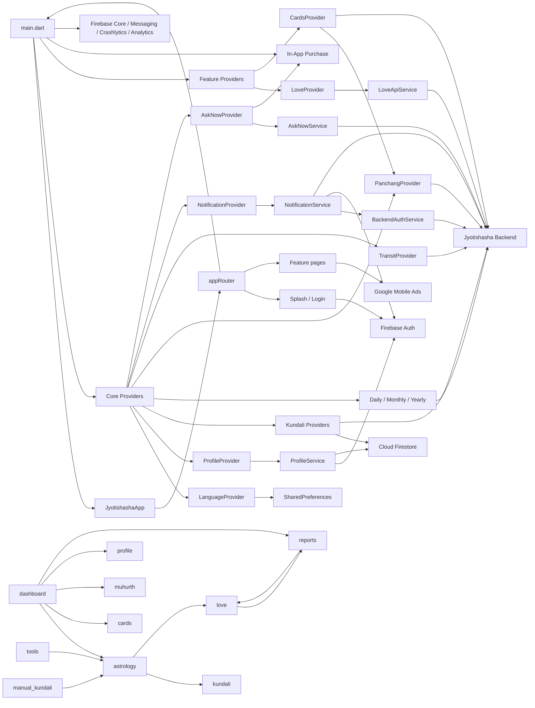

# Enterprise Dependency Graph Audit

## Audit basis

This report analyzes the current Dart sources under `lib/`: 161 Dart files and 659 import directives at the time of inspection. Active imports and executable references are counted; commented-out references are not treated as dependencies. “Read By” includes `read`, `watch`, `Consumer`, `Selector`, and direct Provider-typed access. “Updated By” identifies callers that invoke a state-changing Provider method, plus internal streams/timers that mutate Provider state.

# SECTION 1 — Provider Dependency Graph

The application contains 15 `ChangeNotifier` Provider classes. Fourteen are registered in `main.dart`; `HomeUpcomingEventsProvider` has no creation or consumption site in `lib/`.

| Provider | Created In | Read By | Updated By | Depends On |
|---|---|---|---|---|
| `LanguageProvider` | `lib/main.dart:71-73`; lazy factory, first consumed by `JyotishashaApp` | `app/app.dart`; astrology metadata; Birth; Reports catalog; Edit Profile; Kundali result widgets; Panchang page/card; greeting/header/share/translator/chaughadiya widgets; Dashboard | Factory starts `loadSavedLanguage()`; Birth and Edit Profile call `setLanguage()` | No other Provider. Direct dependency: SharedPreferences |
| `ProfileProvider` | `lib/main.dart:74` | Dashboard/page/home; Horoscope; AskNow; Manual Kundali; Reports; Love; Profile pages; Transit alert; Greeting header | Dashboard/Profile/Profile List call `loadProfiles()`; Add/Edit/Profile pages call add/update/delete/activate methods | No other Provider. Owns `ProfileService` |
| `FirebaseKundaliProvider` | `lib/main.dart:75` | Dashboard; Astrology page; astrology tool section | Dashboard calls `loadFromFirebaseProfile()` | No other Provider. Direct Firebase Auth/Firestore and backend HTTP dependencies |
| `KundaliProvider` | `lib/main.dart:76` | Birth and Add Profile | Birth and Add Profile invoke `bootstrapUserProfile()`; no active caller of `fetchManualKundali()` was found | No other Provider. Direct backend HTTP dependency |
| `ManualKundaliProvider` | `lib/main.dart:77` | Manual Kundali form/result | Manual form calls `generateKundali()` | No other Provider. Direct backend HTTP dependency |
| `DailyProvider` | `lib/main.dart:78` | Horoscope card, Greeting header, Dashboard, Horoscope page | Dashboard startup/refresh, Horoscope tab loading, and Greeting language-refresh callback call `fetchDaily()` | No other Provider. Direct backend HTTP dependency |
| `MonthlyProvider` | `lib/main.dart:79` | Horoscope page and horoscope card | Horoscope tab loading calls `fetchMonthly()` | No other Provider. Direct backend HTTP dependency |
| `YearlyProvider` | `lib/main.dart:80` | Horoscope page and horoscope card | Horoscope tab loading calls `fetchYearly()` | No other Provider. Direct backend HTTP dependency |
| `PanchangProvider` | `lib/main.dart:81`; constructor starts periodic clock timer when lazily created | Dashboard; Panchang page; Panchang/chaughadiya widgets; Cards page; `CardsProvider` method parameters | Dashboard calls `fetchPanchang()`; Panchang and Cards pages call `loadPanchang()`; internal minute timer calls `notifyListeners()` | No upstream Provider in its own implementation. It is passed downstream into `CardsProvider` |
| `TransitProvider` | `lib/main.dart:82`; constructor immediately calls `fetchTransit()` when lazily created | Transit page and transit alert widget; Dashboard Home refresh | Constructor and Dashboard Home call `fetchTransit()`; transit alert calls `fetchTransitContent()` | No other Provider. Direct backend HTTP dependency |
| `LoveProvider` | `lib/main.dart:83` | Love partner/result pages and premium CTA | Partner form and result hub call `setPayload()`; result hub calls `ensureTool()`; internal API completions update per-tool results | No other Provider. Owns `LoveApiService` |
| `NotificationProvider` | `lib/main.dart:84` | Main foreground-message callback; Dashboard/page/home; Greeting header and notification sheet | Main calls `increment()`; Dashboard/Home/Header call `loadUnreadCount()`; Header calls `reset()` after mark/read flow | No other Provider. Uses `NotificationService` |
| `CardsProvider` | `lib/main.dart:85` | Cards page | Cards page calls `loadCards()` | **`PanchangProvider`**, passed as a required parameter to `loadCards()` and `_fetchMuhurthCards()`; also reads assets and backend API directly |
| `AskNowProvider` | `lib/main.dart:87-94` with `lazy: false` | AskNow page and trending-questions widget | Main factory and AskNow page call `initBilling()`; AskNow page calls `applyStatusFromBackend()`, `askFreeOrFromTokens()`, `earnedReward()`, and `startGooglePlayPackPurchase()`; purchase stream mutates state internally | No other Provider. Uses `AskNowService`, In-App Purchase, and direct verification HTTP |
| `HomeUpcomingEventsProvider` | No creation site found | No read site found | No caller found | No other Provider. Direct backend HTTP dependency exists inside the class |

## Provider-to-Provider edges

Only one Provider implementation imports another Provider implementation:

```text
CardsProvider -> PanchangProvider
```

`CardsProvider.loadCards()` requires a live `PanchangProvider` object (`lib/features/cards/provider/cards_provider.dart:244-247`). `CardsPage` resolves both objects from context and passes Panchang into Cards (`lib/features/cards/presentation/cards_page.dart:23-35`). Other multi-provider feature flows coordinate Providers in widgets/pages rather than importing one Provider into another.

## Provider creation behavior

- All root registrations except AskNow use Provider's default lazy creation.
- `AskNowProvider` is explicitly eager and subscribes to `InAppPurchase.purchaseStream` during root construction.
- `TransitProvider` performs a backend fetch in its constructor, but only once something first resolves the lazy provider.
- `PanchangProvider` starts a periodic one-minute timer in its constructor, likewise only after first resolution.
- `HomeUpcomingEventsProvider` is not present in `MultiProvider` and has no alternative constructor call.

# SECTION 2 — Service Dependency Graph

## Named services and service-like adapters

| Service | Used By | Internal Dependencies | External Systems | Persistence / SDK Category |
|---|---|---|---|---|
| `AuthService` | `LoginPage` | `BackendAuthService` | Firebase Auth, Cloud Firestore, Google Sign-In, Facebook Auth, Jyotishasha backend registration | Firebase + authentication API |
| `AskNowService` | `AskNowProvider`, `AskNowChatPage` | None | Jyotishasha backend chat/status/reward endpoints | HTTP API |
| `BackendAuthService` | `AuthService`, `NotificationService` | None | Jyotishasha backend Firebase-user registration and backend-token endpoints | HTTP API |
| `UserBootstrapService` | No use site found | None | `POST /api/user/bootstrap` on Jyotishasha backend | HTTP API; disconnected service node |
| `ReportService` | `ReportPaymentPage` | None | Jyotishasha backend report-generation endpoint | HTTP API |
| `ProfileService` | Owned by `ProfileProvider` | None | Firebase Auth and Cloud Firestore `users/{uid}/profiles` | Firebase persistence |
| `PersonalizedHoroscopeService` | No use site found | None | Jyotishasha backend daily/monthly/yearly personalized horoscope endpoints | HTTP API; disconnected service node |
| `NotificationService` | `NotificationProvider`, Greeting notification sheet | `BackendAuthService` | Firebase Auth plus Jyotishasha notification/token APIs | Firebase identity + HTTP API |
| `LocationService` | Birth, Manual Kundali, Reports checkout form, Add/Edit Profile, Panchang, Muhurth, Love partner form, core place picker | None | Google Places Autocomplete, Place Details, and Time Zone HTTP APIs | External HTTP API |
| `BlogService` | No use site found | `BlogPost` model | `astroblog.in` WordPress REST API | HTTP API; disconnected service node |
| `LoveApiService` | Owned by `LoveProvider` | `LoveTool` enum | Jyotishasha backend Love endpoint | HTTP API |
| `CardService` | No use site found; `CardsProvider` performs its own asset/API work | `CardModel` | Jyotishasha `/api/cards` endpoint | HTTP API; disconnected service node |
| `RewardAdService` | No construction/use site found | Google Mobile Ads types | AdMob rewarded ads | Ads SDK; disconnected service node |
| `AdService` | No call site found | `AdIds` | Mobile Ads initialization, banner, interstitial, and rewarded ads | Ads SDK; disconnected service node |
| `PlayBillingStub` | `main()` | Static `InAppPurchase.instance` | Google Play Billing availability | Billing SDK |
| `RewardedAdManager` | `AskNowChatPage` | `AdUnits` | AdMob rewarded ad load/show callbacks | Ads SDK |

## Direct external dependencies outside service classes

The current graph also contains external-system calls embedded in Providers and pages rather than routed through a `*Service` class.

| Owner | Direct external dependencies |
|---|---|
| `FirebaseKundaliProvider` | Firebase Auth, Cloud Firestore, Jyotishasha full-kundali API |
| `KundaliProvider`, `ManualKundaliProvider` | Jyotishasha kundali/bootstrap APIs |
| `DailyProvider`, `MonthlyProvider`, `YearlyProvider` | Jyotishasha horoscope APIs |
| `PanchangProvider`, `TransitProvider`, `HomeUpcomingEventsProvider` | Jyotishasha panchang/transit/events APIs |
| `CardsProvider` | Flutter asset bundle plus Jyotishasha muhurth API; it does not call `CardService` |
| `AskNowProvider` | In-App Purchase stream/product purchase plus direct `/api/chatpack/verify`; other chat calls use `AskNowService` |
| `LanguageProvider` | SharedPreferences key `app_lang` |
| `DashboardPage` | Firebase Auth, Firestore, Firebase Messaging, Firebase ID token, direct backend FCM update |
| `LoginPage` | Cloud Firestore profile existence check in addition to `AuthService` |
| `BirthDetailPage`, `AddProfilePage` | Firebase Auth/Firestore in addition to Providers and `LocationService` |
| `AskNowChatPage`, `ReportPaymentPage` | Firebase Auth/Firestore identity lookup; Report Payment also owns an In-App Purchase stream |
| `ToolResultPage` | SharedPreferences cache plus direct tool API HTTP |
| Astrology/Kundali/Cards share flows | `path_provider`, local `File`, rendering capture, and `share_plus` |
| Banner/reward/interstitial widgets and Transit page | Google Mobile Ads objects directly |
| `BlogReaderPage` | WebView URL loading directly; it does not use `BlogService` |

# SECTION 3 — Feature Dependencies

The “Other Features” column contains direct source imports from one feature folder into another under `lib/features`. Core widgets/providers and root route imports are not counted as feature-to-feature edges.

| Feature Folder | Providers Used | Services Used | Other Features Directly Imported | Other Direct Dependencies |
|---|---|---|---|---|
| `asknow` | `AskNowProvider`, `ProfileProvider` | `AskNowService`, `RewardedAdManager` | None | Firebase Auth/Firestore, banner/reward ads |
| `astrology` | `FirebaseKundaliProvider`, `LanguageProvider` | None | `kundali`, `love` | GoRouter, banner ads, path provider, file/render capture, share_plus |
| `birth` | `KundaliProvider`, `LanguageProvider` | `LocationService` | None | Firebase Auth/Firestore, GoRouter |
| `blog` | None | None (`BlogService` is not referenced) | None | WebView |
| `cards` | `CardsProvider`, `PanchangProvider` | None (`CardService` is not referenced) | None | Direct HTTP/assets, path provider, render capture, share_plus |
| `darshan` | None | None | None | AudioPlayer global context, banner ad, shared share widget |
| `dashboard` | `FirebaseKundaliProvider`, `DailyProvider`, `PanchangProvider`, `ProfileProvider`, `LanguageProvider`, `NotificationProvider`, `TransitProvider` | None | `astrology`, `cards`, `muhurth`, `profile`, `reports` | Firebase Auth/Firestore/Messaging, direct backend HTTP, core feature widgets |
| `error` | None | None | None | Flutter UI only |
| `horoscope` | `DailyProvider`, `MonthlyProvider`, `YearlyProvider`, `ProfileProvider` | None | None | GoRouter, share_plus, core horoscope/share widgets |
| `kundali` | `LanguageProvider` | None | None | Direct HTTP in form, path provider, render capture, share_plus, core chart/metadata |
| `login` | None | `AuthService` | None | Firestore profile check, GoRouter |
| `love` | `LoveProvider`, `ProfileProvider` | `LoveApiService`, `LocationService` | `reports` | Direct HTTP inside Love API service, Provider listeners |
| `manual_kundali` | `ManualKundaliProvider`, `ProfileProvider` | `LocationService` | `astrology` | Banner ad, path provider, render capture, share_plus |
| `muhurth` | None | `LocationService` | None | Direct Jyotishasha HTTP, banner ad, localization/share/core widgets |
| `onboarding` | None | None | None | GoRouter and Flutter UI |
| `panchang` | `PanchangProvider`, `LanguageProvider` | `LocationService` | None | Banner ad and shared feedback/share widgets |
| `profile` | `ProfileProvider`, `LanguageProvider`, `KundaliProvider` | `LocationService` | None | Firebase Auth/Firestore, Google Sign-In, URL launcher |
| `reports` | `LanguageProvider`, `ProfileProvider` | `ReportService`, `LocationService` | `love` | Firebase Auth/Firestore, In-App Purchase, JSON asset loading |
| `splash` | None | None | None | Firebase Auth and GoRouter |
| `subscription` | None | None | None | Flutter UI only |
| `tools` | None | None | `astrology` | Direct HTTP, SharedPreferences cache, tool registry, shimmer |
| `transit` | `TransitProvider` | None | None | Google Mobile Ads and URL launcher |

## Direct feature-edge list

```text
astrology -> kundali
astrology -> love
dashboard -> astrology
dashboard -> cards
dashboard -> muhurth
dashboard -> profile
dashboard -> reports
love -> reports
manual_kundali -> astrology
reports -> love
tools -> astrology
```

# SECTION 4 — Circular Dependencies

## File-level import cycles

Static import analysis found two strongly connected components.

### Application bootstrap/router cycle

```text
lib/main.dart
  -> lib/app/app.dart
  -> lib/app/routes/app_routes.dart
  -> lib/main.dart
```

- `main.dart` imports `app.dart` to launch `JyotishashaApp` (`lib/main.dart:9`).
- `app.dart` imports `app_routes.dart` for `appRouter` (`lib/app/app.dart:4`).
- `app_routes.dart` imports `main.dart` for the top-level `analytics` object (`lib/app/routes/app_routes.dart:21,31`).

### Generated localization cycle

```text
app_localizations_en.dart <-> app_localizations.dart <-> app_localizations_hi.dart
```

The base generated localization library imports both locale implementations (`lib/l10n/app_localizations.dart:8-9`), and each implementation imports the base class (`lib/l10n/app_localizations_en.dart:3`, `app_localizations_hi.dart:3`). All three files therefore form one import SCC.

## Feature-level cycle

```text
reports -> love -> reports
```

- Reports imports `LovePartnerFormPage` for `relationship_future_report` (`lib/features/reports/pages/report_catalog_page.dart:16`).
- Love imports `ReportPaymentPage` from Reports in both `love_partner_form_page.dart:7` and `love_premium_cta_card.dart:5`.

This is a feature-folder cycle. It is not a file-level SCC because the specific Reports file imported by Love does not import back into Love.

## Logical cycles and feedback loops

| Flow | Evidence |
|---|---|
| Sole-profile activation recursion | `ProfileProvider.loadProfiles()` calls `ProfileService.setActiveProfile()` and recursively calls `loadProfiles()` when exactly one returned profile is not active (`lib/core/state/profile_provider.dart:23-35`) |
| Love result event loop | `LoveResultHubPage` calls `LoveProvider.ensureTool()`; Provider completion calls `notifyListeners()`; the page listener schedules result-page navigation (`lib/features/love/pages/love_result_hub_page.dart`, `love_provider.dart`) |
| AskNow purchase event loop | UI starts a purchase through `AskNowProvider`; the Provider-owned purchase stream receives status updates and mutates the same state observed by the UI (`lib/core/state/asknow_provider.dart:55-83,168-221`) |
| Notification refresh feedback | Foreground FCM increments `NotificationProvider`; notification UI marks an item through `NotificationService`, calls `loadUnreadCount()`, and reloads the notification list (`lib/main.dart:50-59`, `lib/core/widgets/greeting_header_widget.dart`) |
| Panchang-to-Cards data loop | Cards page ensures Panchang data, then passes Panchang state into Cards loading; Cards output is rebuilt by `CardsProvider` while Panchang maintains its own timed notifications (`lib/features/cards/presentation/cards_page.dart:23-35`) |

## Cross-feature and Provider coupling summary

- Dashboard directly depends on five other feature folders and is the largest feature-level fan-out node.
- Astrology directly consumes Kundali result widgets and enters Love.
- Manual Kundali consumes Astrology presentation/tool widgets.
- Tools directly opens Astrology.
- Reports and Love depend on each other at feature-folder level.
- `CardsProvider -> PanchangProvider` is the only direct Provider-to-Provider import edge.
- Widget/page coordinators create additional runtime coupling among Providers without Provider-level imports, especially Dashboard, Horoscope, AskNow, Cards, and Profile.

# SECTION 5 — Global Dependency Map



# SECTION 6 — High Coupling Files

Counts below are direct unique internal Dart imports plus distinct external SDK/package library roots. They measure static outgoing dependencies, not runtime call frequency.

| File | Internal | External | Why the current file has high coupling |
|---|---:|---:|---|
| `lib/main.dart` | 18 | 7 | Imports root app, Firebase configuration, 14 Provider types, billing, Firebase SDKs, and global context; creates the application graph |
| `lib/features/dashboard/dashboard_home_section.dart` | 17 | 5 | Composes many core widgets, four downstream feature entry points, four Providers, Firebase Auth, asset loading, and GoRouter/Navigator behavior |
| `lib/features/dashboard/dashboard_page.dart` | 14 | 7 | Depends on seven Providers, five feature pages, banner ads, Firebase Auth/Firestore/Messaging, HTTP, localization, and system navigation |
| `lib/app/routes/app_routes.dart` | 13 | 4 | Imports entry/main feature pages, Firebase Auth, analytics observer, GoRouter, and `main.dart` analytics |
| `lib/features/astrology/astrology_tool_detail_page.dart` | 11 | 5 | Selects among multiple Kundali result widgets, shared chart/ad/localization infrastructure, rendering, filesystem, and sharing |
| `lib/core/widgets/greeting_header_widget.dart` | 9 | 3 | Uses Profile/Daily/Language/Notification state, multiple feature pages, NotificationService, localization, and direct Navigator transitions |
| `lib/features/asknow/asknow_chat_page.dart` | 8 | 5 | Couples AskNow/Profile Providers, AskNow service, Firebase identity, ads, keyboard wrapper, localization, and widget state/listeners |
| `lib/features/horoscope/horoscope_page.dart` | 8 | 4 | Coordinates four Providers, core horoscope/share widgets, localization, GoRouter, and share SDK |
| `lib/features/panchang/panchang_page.dart` | 8 | 3 | Combines two Providers, LocationService, ads, localization, feedback/share widgets, and location modal control |
| `lib/features/astrology/astrology_page.dart` | 7 | 6 | Uses Firebase Kundali, Love feature entry, astrology sections, localization, ads, rendering/filesystem, and sharing |

## High fan-in dependencies

The most-imported internal files are:

| File | Direct Importers | Dependency role |
|---|---:|---|
| `lib/l10n/app_localizations.dart` | 29 | Shared generated localization API |
| `lib/core/state/language_provider.dart` | 18 | Application language source |
| `lib/core/constants/app_colors.dart` | 17 | Shared visual constants |
| `lib/core/state/profile_provider.dart` | 16 | Shared active/profile collection state |
| `lib/core/ads/banner_ad_widget.dart` | 9 | Reused banner-ad adapter |
| `lib/features/love/enums/love_tool.dart` | 9 | Love tool identity shared across Love flow |
| `lib/services/location_service.dart` | 9 | Shared place/timezone API adapter |
| `lib/features/love/providers/love_provider.dart` | 8 | Shared Love flow state |
| `lib/core/state/panchang_provider.dart` | 7 | Panchang state used by pages/widgets/Cards |
| `lib/core/state/daily_provider.dart` | 6 | Daily horoscope state used across Dashboard/Horoscope widgets |

# SECTION 7 — Low Coupling Files

These files have small, bounded static dependency surfaces and focused current responsibilities.

| File | Static dependency surface | Current responsibility |
|---|---|---|
| `lib/features/error/error_page.dart` | Flutter only; no internal imports | Displays an error message page |
| `lib/features/subscription/subscription_page.dart` | Flutter only; no internal imports | Displays the current subscription placeholder page |
| `lib/core/widgets/keyboard_dismiss.dart` | Flutter only; no internal imports | Wraps a child and dismisses keyboard focus on tap |
| `lib/features/reports/widgets/report_card.dart` | Flutter only; no internal imports | Renders report-card input data and callback |
| `lib/features/love/widgets/intro_tool_card.dart` | Flutter only; no internal imports | Renders a Love tool introduction card |
| `lib/features/asknow/widgets/asknow_header_status_widget.dart` | Flutter only; no internal imports | Renders AskNow status/header inputs |
| `lib/core/models/blog_models.dart` | No imports | Defines and parses blog model data |
| `lib/features/cards/data/card_model.dart` | No imports | Defines card model and enum data |
| `lib/services/backend_auth_service.dart` | `dart:convert` and HTTP only; no internal import | Adapts backend registration/token endpoints |
| `lib/services/report_service.dart` | `dart:convert` and HTTP only; no internal import | Sends report-generation request |
| `lib/services/location_service.dart` | `dart:convert` and HTTP only; no internal import | Adapts three Google Maps HTTP endpoints |
| `lib/features/love/services/love_api_service.dart` | Love enum plus `dart:convert`/HTTP | Maps a `LoveTool` and payload to one backend request |

Static data catalogs such as `planet_names.dart`, `card_templates.dart`, `night_thoughts.dart`, `share_templates.dart`, and `ad_units.dart` have no internal import dependencies.

# SECTION 8 — ESR Migration Impact

Impact is classified from current fan-in, state ownership, external-system reach, initialization timing, and cross-feature use. It is not a recommendation or target-state design.

| Major Dependency / Boundary | Impact | Evidence for classification |
|---|---|---|
| `main.dart` bootstrap and root `MultiProvider` | **HIGH** | Creates 14 application-scope Providers and initializes Firebase, billing, messaging, Crashlytics, HTTP override, and root app |
| `appRouter` / GoRouter route graph | **HIGH** | Central entry/auth policy and direct imports of entry/main feature pages; participates in bootstrap import cycle |
| Firebase Auth session access | **HIGH** | Used by router, Splash, Dashboard, Auth/Profile/Notification/Kundali services/providers, AskNow, Reports, Birth, and Profile |
| Cloud Firestore user/profile schema | **HIGH** | Drives login profile branching, profile CRUD, kundali active profile, backend IDs, FCM storage, Birth/Add Profile |
| `ProfileProvider` + `ProfileService` | **HIGH** | 16 direct importers; shared by Dashboard, Horoscope, AskNow, Manual Kundali, Reports, Love, Profile, Transit and Greeting |
| Kundali providers and Kundali result model/widgets | **HIGH** | Multiple generation paths, Firestore/backend input, Astrology/Kundali/Manual feature sharing, and broad result rendering |
| Dashboard shell and startup chain | **HIGH** | Highest feature fan-out and coordinates seven Providers plus Firebase/HTTP/platform behavior |
| Reports ↔ Love boundary | **HIGH** | Bidirectional feature imports and shared transition into `ReportPaymentPage`; includes Provider/API/billing flows |
| In-App Purchase flows | **HIGH** | Eager AskNow stream, AskNow product/verification, independent Report Payment stream and report completion |
| Generated localization API + `LanguageProvider` | **HIGH** | 29 and 18 direct importers respectively; affects root locale and feature data requests; generated localization SCC |
| Jyotishasha backend API surface | **HIGH** | Accessed by most Providers and multiple services/pages across identity, profiles, horoscope, kundali, panchang, transit, reports, notifications, AskNow, Love, and Cards |
| `PanchangProvider` | **MEDIUM** | Seven direct importers, timed state, Dashboard/Panchang widgets, and explicit `CardsProvider` coupling |
| `DailyProvider` / `MonthlyProvider` / `YearlyProvider` | **MEDIUM** | Shared Horoscope rendering; Daily also participates in Dashboard and Greeting refresh |
| `NotificationProvider` + `NotificationService` + FCM | **MEDIUM** | Main event listener, Dashboard lifecycle, Greeting sheet, backend token chain, Firestore/backend FCM writes |
| `LocationService` / Google Maps APIs | **MEDIUM** | Nine direct importers across six feature domains and core place picker |
| `TransitProvider` | **MEDIUM** | Constructor fetch, Dashboard refresh, alert widget, and detail page |
| `CardsProvider` | **MEDIUM** | Feature-scoped consumer count, but depends on Panchang and combines assets/backend/time-based selection |
| `AskNowProvider` / `AskNowService` | **HIGH** | Application-eager billing listener plus auth/profile/backend/ads/chat/payment state |
| `LoveProvider` / `LoveApiService` | **MEDIUM** | Eight direct importers inside Love, listener-driven result flow, Reports boundary |
| Google Mobile Ads adapters/widgets | **MEDIUM** | Used across Dashboard, Astrology, Darshan, Manual Kundali, Muhurth, Panchang, Transit, and AskNow; several parallel ad abstractions exist |
| SharedPreferences | **MEDIUM** | Root language persistence plus Tool Result cache; language has application-wide fan-in |
| Share/file/render pipeline | **MEDIUM** | Repeated in Astrology, Kundali, Manual Kundali, Cards, and Horoscope-related flows |
| `AuthService` | **MEDIUM** | One direct page consumer, but reaches four identity/data systems and backend synchronization |
| `HomeUpcomingEventsProvider` | **LOW** | No creator or consumer found; isolated HTTP implementation |
| `UserBootstrapService`, `PersonalizedHoroscopeService`, `BlogService`, `CardService` | **LOW** | No use sites found in current `lib/` graph |
| `AdService`, `RewardAdService` | **LOW** | No use sites found; active ad flows use widgets or `RewardedAdManager` instead |
| Leaf UI/model/data files listed in Section 7 | **LOW** | Zero or one internal dependency and no orchestration role |
