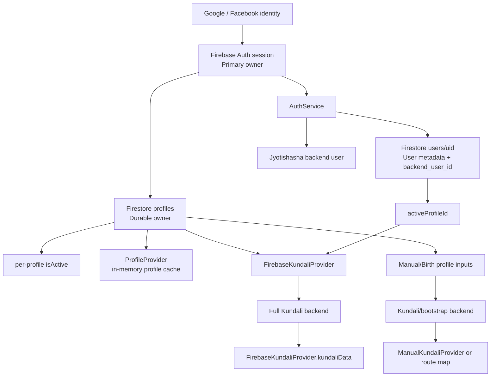
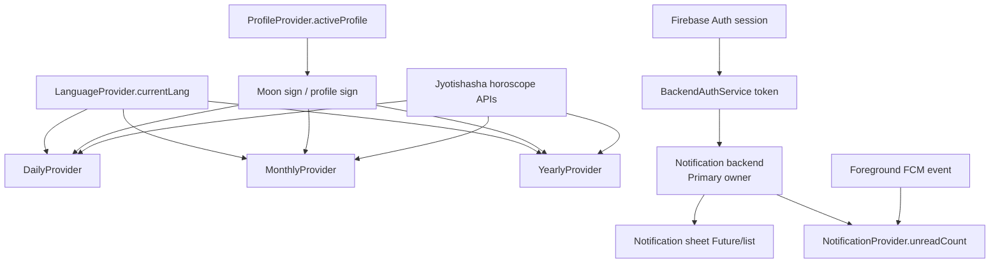
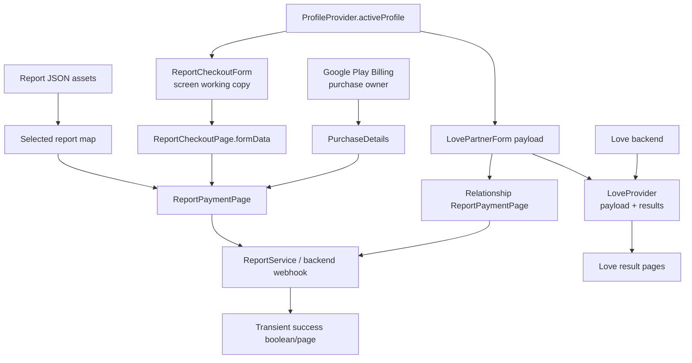

# Enterprise Data Ownership Audit

## Audit basis

This document records ownership visible in the current `lib/` implementation. “Primary Owner” means the authority the running application treats as the source of truth for that object. A Provider may be the in-memory owner while Firestore, SharedPreferences, Google Play, or the backend remains the durable/external authority. Where the implementation maintains competing authority markers or does not establish an owner, the table explicitly says **NO SINGLE OWNER**.

# SECTION 1 — Application Data Inventory

## Identity, user, and profile data

| Data Object | Current Representation |
|---|---|
| Authentication session | `FirebaseAuth.instance.currentUser` / Firebase `User` |
| Google/Facebook identity | Provider credentials used by `AuthService` |
| Firestore user record | `users/{uid}` map containing identity metadata, `activeProfileId`, `backend_user_id`, and FCM data |
| Backend user identity | Numeric `backend_user_id` issued by backend and copied into Firestore |
| Profiles list | Firestore `users/{uid}/profiles` documents and `ProfileProvider.otherProfiles` |
| Active profile | A profile map, root `activeProfileId`, each profile's `isActive`, and `ProfileProvider.activeProfile/activeProfileId` |
| Profile birth/location fields | `name`, `dob`, `tob`, `pob`, `lat`, `lng`, optional timezone/language in Firestore maps and form state |
| Profile astrology summary | `lagna`, `moon_sign`, `nakshatra`, backend profile ID, `profile_complete` in profile documents |
| Profile editor/add/birth drafts | Text controllers, coordinates, language/gender, suggestion lists, and loading flags in screen State objects |
| Backend profile ID | `backendProfileId` in direct Firestore writes; normalized to `backend_profile_id` in `ProfileProvider`/`ProfileService` paths |

## Application preferences and presentation data

| Data Object | Current Representation |
|---|---|
| Language | `LanguageProvider.currentLang` and SharedPreferences `app_lang` |
| Theme | Static `AppTheme.lightTheme`; `JyotishashaApp` forces `ThemeMode.light` |
| Localization resources | Generated `AppLocalizations` delegates/localized strings |
| Dashboard selected tab | `_DashboardPageState._currentIndex` |
| Dashboard back timing | `_DashboardPageState._lastPressed` |
| Home report selection | `DashboardHomeSection.homeReports`, derived from `assets/data/reports.json` |
| Report catalog | `ReportCatalogPage.reports`, loaded from English/Hindi JSON assets |
| Report category filter | `ReportCatalogPage.selectedCategory` |

## Astrology and generated-content data

| Data Object | Current Representation |
|---|---|
| General kundali result | `KundaliProvider.kundaliData` map |
| Manual kundali result | `ManualKundaliProvider.kundali` map |
| Firebase-profile kundali | `FirebaseKundaliProvider.kundaliData` map |
| Firebase profile snapshot used for kundali | `FirebaseKundaliProvider.profileData` map |
| Direct Kundali Form result | Local decoded map passed directly to `KundaliDetailPage` |
| Typed kundali models | `KundaliModel` and nested typed objects; separate `KundaliData/HouseData` chart model |
| Daily horoscope | Title, intro, paragraph, tips, lucky color/number and sign/language cache in `DailyProvider` |
| Monthly horoscope | Title, theme, career, love, health, advice, key dates and cache keys in `MonthlyProvider` |
| Yearly horoscope | Title, response map and sign/language/year cache keys in `YearlyProvider` |
| Transit | `TransitProvider.transitData`, personalized `contentData`, language and derived planet list |
| Panchang | `PanchangProvider.fullPanchang`, `nextPanchang`, fetch date/language, coordinates, derived getters |
| Home upcoming events | `HomeUpcomingEventsProvider.events`, next event, coordinates; Provider has no creation site |
| Muhurth results | `MuhurthPage.muhurthResults`, top-level `muhurthCache`, and separate `CardsProvider._muhurthCache` |
| Tool result | `ToolResultPage.data`, loading/error state, and a timestamped SharedPreferences cache |

## Cards, AskNow, Love, notifications, reports, and commerce

| Data Object | Current Representation |
|---|---|
| Cards feed | `CardsProvider._cards` as `List<CardModel>` |
| Cards source/cache data | `_astroData`, insight asset data, templates, night thoughts, image pool, private muhurth cache |
| AskNow entitlement/status | Free availability/use, active-pack flag, remaining tokens, loaded flag in `AskNowProvider` |
| AskNow answer/error | `AskNowProvider.pendingAnswer`, `lastErrorMessage` |
| AskNow visible chat | `AskNowChatPage.chatMessages` plus pending question/profile/user ID |
| AskNow ad progress | `_adsWatched` in AskNow page |
| Love request payload | `LoveProvider._payload` and copies passed through Love widgets/routes |
| Love results | `LoveProvider._resultsByTool`, loading map, result-version map, error |
| Notification list | Backend list held as a `Future<List>` in the notification-sheet State inside `greeting_header_widget.dart` |
| Unread notification count | Backend `unread_count` copied into `NotificationProvider.unreadCount` |
| FCM token | Firebase Messaging token copied to Firestore user record and backend |
| Selected report | Asset-derived report map passed between catalog/home, checkout, payment, and success pages |
| Report checkout data | Profile-derived and edited form maps/controllers in Checkout page/form |
| Billing product details | Temporary Google Play `ProductDetails` returned by queries |
| Purchase transaction | Google Play `PurchaseDetails`, product ID and verification token handled by AskNow/Report flows |
| Generated/purchased report outcome | Boolean backend response and temporary `ReportSuccessPage` title/email; no report collection/model is stored in the app |
| Subscription status | No status model, Provider, service, backend read, or persisted value; Subscription page contains static placeholder text |

## Other runtime and infrastructure data

| Data Object | Current Representation |
|---|---|
| Location search data | Screen-local query controllers, suggestions, selected place, coordinates/timezone; shared `LocationService` responses |
| Blog data | `BlogPost` model/`BlogService` chain is unused; a separate `BlogCarouselWidget -> BlogReaderPage` URL/title chain also has no caller |
| Ads | Static cached ad/load flags in ad managers plus per-widget ad/readiness state |
| Global context | Mutable `globalKundaliContext` |
| Analytics/router | Top-level `analytics` singleton and `appRouter` |
| Loading/error flags | Distributed across Providers and StatefulWidgets, scoped to their owning object |

# SECTION 2 — Data Ownership

| Data | Primary Owner | Secondary Owner | Created By | Updated By | Read By |
|---|---|---|---|---|---|
| Authentication session | Firebase Auth | `AuthService` holds an Auth handle; router/pages take snapshots | Google/Facebook credential sign-in through `AuthService` | Firebase Auth sign-in/sign-out; Profile page also signs out directly | Router, Splash, Dashboard, services/providers, Birth/Profile/AskNow/Reports |
| Firestore user record | Cloud Firestore `users/{uid}` | Backend owns the backend user entity; Firebase Auth owns core identity fields | `AuthService._createOrUpdateUser()` | `AuthService`, Birth, Dashboard FCM flow | Login/Profile/Kundali/AskNow/Report/Notification paths |
| Backend user ID | Firestore root user document for app lookups | Jyotishasha backend issues the ID | `BackendAuthService.registerFirebaseUser()`; copied by `AuthService` | Auth synchronization | AskNow and Report Payment read Firestore directly |
| Profiles collection | Cloud Firestore profile subcollection | `ProfileProvider` memory cache | Birth creates `default`; Add Profile creates generated IDs; `ProfileService.addProfile()` is another creation path | `ProfileService`, Birth, Add/Edit/Profile pages | ProfileProvider and all profile-dependent features |
| Active profile selection | **NO SINGLE OWNER** | Root `activeProfileId`, profile `isActive`, and `ProfileProvider.activeProfileId` all represent selection | Birth sets root default; ProfileService can auto-activate first profile | ProfileService changes all `isActive` flags and root ID; direct Birth/Add flows also set data | FirebaseKundaliProvider follows root ID; ProfileProvider determines active map from `isActive` |
| Active profile map | `ProfileProvider` in application memory | Firestore profile document | `ProfileProvider.loadProfiles()` from Firestore list | Provider reload/normalize; Profile CRUD persists through service/direct page writes | Dashboard, Horoscope, AskNow, Reports, Love, Transit, Greeting, Profile UI |
| Profile draft fields | Owning form State | Initial profile map / text controllers duplicate values | Birth/Add/Edit/Report/Love/Manual screen construction | User input and LocationService selections | Form validation and submission methods |
| Profile astrology summary | Firestore profile document | Backend bootstrap response before persistence; ProfileProvider cache after load | `KundaliProvider.bootstrapUserProfile()` backend response | Birth/Add Profile writes | Horoscope, kundali input, profile-dependent features |
| Backend profile ID | **NO SINGLE OWNER** | Backend response, Firestore camelCase key, normalized snake_case Provider key | Kundali bootstrap backend | Birth/Add direct writes; ProfileService normalizes only its own CRUD inputs; ProfileProvider adds normalized key in memory | ProfileProvider consumers/AskNow-related profile payloads |
| Language | `LanguageProvider` for live application state | SharedPreferences `app_lang`; profile document also carries language | Provider default `en`, then saved preference/profile workflow | `LanguageProvider.setLanguage()` from Birth/Edit Profile; startup load | Root app, Dashboard, reports, astrology/kundali/panchang/cards/share widgets |
| Theme | `AppTheme.lightTheme` / root `MaterialApp` configuration | Static color classes used independently | Static declarations | Not dynamically updated | Entire Flutter widget tree and feature widgets |
| General kundali map | `KundaliProvider` when `fetchManualKundali()` is used | Backend response | Jyotishasha full-kundali endpoint | `fetchManualKundali()`, `reset()` | No active consumer of `KundaliProvider.kundaliData` found |
| Manual kundali map | `ManualKundaliProvider` | Backend response | Manual form request | `generateKundali()`, `reset()` | Manual result page and manual astrology section |
| Firebase-profile kundali | `FirebaseKundaliProvider` | Backend generates response; Firestore supplies input profile | Dashboard calls `loadFromFirebaseProfile()` | Provider load/clear | Dashboard and Astrology screens/tool section |
| Firebase profile snapshot | `FirebaseKundaliProvider.profileData` | Firestore profile and `ProfileProvider.activeProfile` are other copies | Firestore read inside FirebaseKundaliProvider | Provider load/clear | FirebaseKundaliProvider payload construction |
| Direct Kundali Form result | `KundaliDetailPage` route argument | Local variable in Kundali form | Direct HTTP response in Kundali form | Not updated after navigation | Kundali detail/result widgets |
| Daily horoscope | `DailyProvider` | Backend is response authority | Daily backend endpoint | Dashboard, Horoscope page, Greeting refetch; Provider reset | Greeting/header and horoscope card/page |
| Monthly horoscope | `MonthlyProvider` | Backend is response authority | Monthly backend endpoint | Horoscope page; Provider reset | Horoscope card/page |
| Yearly horoscope | `YearlyProvider` | Backend is response authority | Yearly backend endpoint | Horoscope page; Provider reset | Horoscope card/page |
| Transit data/content | `TransitProvider` | Backend is response authority | Provider constructor/current-transit and content endpoints | Constructor, Dashboard refresh, Transit alert content request | Transit alert and Transit content page |
| Panchang | `PanchangProvider` | Backend response; Cards consumes the same Provider | Panchang backend endpoint | Dashboard/Panchang/Cards loading; minute timer updates listeners | Dashboard widgets, Panchang page, CardsProvider |
| Home upcoming events | `HomeUpcomingEventsProvider` | Backend response | Provider HTTP method | `fetchEvents()` | No consumer found |
| Muhurth results/cache | **NO SINGLE OWNER** | Muhurth page state, top-level cache, CardsProvider private cache, backend response | Muhurth endpoint in page and CardsProvider | Page fetch/location/activity; Cards load | Muhurth UI and Cards generation separately |
| Cards feed | `CardsProvider` | Asset files/templates and backend muhurth data | `CardsProvider.loadCards()` | Cards page triggers load; Provider replaces list | Cards page/render/share widgets |
| Tool result | `ToolResultPage` while screen is alive | SharedPreferences timestamped cache; backend response | Tool endpoint or cache decode | `fetchToolData()` and `_saveCache()` | Tool result UI/registry widgets |
| AskNow entitlement/status | Jyotishasha backend | `AskNowProvider` cache | `/api/chat/status`, chat/reward/verification responses | Provider methods and purchase stream | AskNow page/header/trending widget |
| AskNow pending answer/error | `AskNowProvider` | AskNow page listener copies answer into visible chat | AskNowService/provider verification | Provider chat/purchase/reward methods; `clearPending()` | AskNow page listener/UI |
| Visible AskNow chat history | `AskNowChatPage` State | Provider holds only pending answer/error, not the history | User submissions and provider-answer callback | Page methods | AskNow message list |
| Love payload | `LoveProvider` for live feature state | LovePartnerForm local payload, `LoveResultHubPage.widget.payload`, Report Payment `formData["love_payload"]` | Love partner form | `setPayload()` / `reset()` | Love API/result pages and premium report flow |
| Love results | `LoveProvider` | Backend response | `LoveApiService.run()` | `ensureTool()`/internal completion/reset | Love hub and four result pages |
| Notification list | Jyotishasha backend | Notification-sheet `_future`/snapshot | Notification API | Backend mark-read; widget reloads Future | Notification bottom sheet |
| Unread notification count | Jyotishasha backend | `NotificationProvider.unreadCount` | Unread-count endpoint; foreground FCM can locally increment | NotificationProvider load/increment/reset | Dashboard/Greeting badge |
| FCM token | **NO SINGLE OWNER** | Firebase Messaging generates; Firestore and backend each store copies | `FirebaseMessaging.getToken()` | Dashboard token flow, token delete/recreate | Firestore/backend notification delivery systems |
| Report catalog | JSON assets | ReportCatalogPage and DashboardHome local lists | `reports.json` / `reports_hi.json` asset decode | Screen-local filtering/localization/shuffle | Dashboard report cards and Reports catalog |
| Selected report | Route/widget argument map | Same map passed through multiple page constructors | Asset report entry or hard-coded relationship report map | Not centrally updated | Checkout, Payment, Success |
| Report checkout form | `ReportCheckoutPage.formData` for navigation | `ReportCheckoutForm` controllers/fields and initial ProfileProvider map | Profile copy plus user edits | Child callback updates parent map | Validation and ReportPaymentPage |
| Billing product details | Google Play Billing | Temporary local query response | `InAppPurchase.queryProductDetails()` | Google Play | AskNowProvider and ReportPaymentPage purchase launch |
| Purchase transaction/receipt | Google Play Billing | `PurchaseDetails` in stream callback; verification token passed into flow | Google Play purchase stream | Google Play status; app completes purchase | AskNow verification and Report Payment generation flow |
| Purchased/generated report | **NO SINGLE OWNER in app** | Backend receives report request; success page keeps only title/email | Report backend webhook after purchase | Backend; app only receives boolean success | ReportSuccessPage displays confirmation |
| Subscription status | **NO OWNER / NOT IMPLEMENTED** | Static SubscriptionPage copy only | None | None | No reader of subscription state |
| Location/place selection | **NO SINGLE OWNER** | Each screen owns its own controllers/coordinates; profile/Panchang Providers retain some coordinates | Google LocationService response or defaults | User selection per screen; persisted when profile is saved | Birth/Profile/Manual/Love/Reports/Panchang/Muhurth/Cards flows |
| Blog content | **NO ACTIVE OWNER** | Unused BlogService/BlogPost chain; isolated BlogCarousel/BlogReader chain owns URL/title/WebView state | Potential WordPress service response, not called | None in active graph | No reachable reader found from current imports/routes |
| Ads state | **NO SINGLE OWNER** | AdService, RewardAdManager, RewardAdService, and individual ad widgets each hold separate objects/flags | Google Mobile Ads callbacks | Each manager/widget independently | Corresponding ad UI/callback |
| Dashboard tab/back state | `DashboardPage` State | None | State initialization | Bottom navigation/back handler | Dashboard shell |
| Global provider context | Top-level `globalKundaliContext` variable | Current `JyotishashaApp.build()` context | Global declaration; assigned on root build | Every root rebuild reassigns it | Main foreground-FCM callback |
| Analytics/navigation configuration | Top-level `analytics` and `appRouter` | Firebase Analytics SDK and GoRouter internal state | Top-level initializers | Router navigation updates SDK/internal state | `MaterialApp.router` and analytics observer |
| Loading/error flags | **NO SINGLE OWNER** | Each Provider and screen owns flags/errors for its own request | Provider/page defaults | Each async flow independently | Corresponding UI only |

# SECTION 3 — Storage Location

| Data Object | Storage Location(s) |
|---|---|
| Authentication session | Firebase Auth SDK-managed persistent session plus in-memory `currentUser` |
| Firestore user/profile records | Cloud Firestore |
| Backend user/profile IDs | Jyotishasha backend; copied into Firestore and Provider maps |
| Language | Root Provider memory + SharedPreferences `app_lang`; profile document also stores a language field |
| Theme/localization | Compiled static Dart/generated resources; no runtime persistence |
| Profile drafts and location suggestions | Temporary widget State and text controllers |
| Active profile/profile list | Firestore + root Provider memory |
| Kundali results | Backend response; Provider memory or route argument only; no local durable kundali storage found |
| Daily/monthly/yearly horoscope | Backend response cached only in root Provider memory |
| Transit | Backend response cached only in root Provider memory |
| Panchang | Backend response cached only in root Provider memory |
| Home upcoming events | Backend response in uncreated Provider memory only |
| Cards | Compiled assets + backend response + CardsProvider memory/private cache |
| Muhurth | Backend response + top-level application-memory cache + widget State; separate CardsProvider cache |
| Tool results | Backend response + screen State + timestamped JSON in SharedPreferences |
| AskNow entitlement/tokens | Backend + AskNowProvider memory |
| AskNow visible messages | AskNow page State only; no message persistence found |
| Love payload/results | LoveProvider memory plus route/widget argument copies; backend returns results but no local durable store |
| Notification list/unread count | Backend + notification widget Future/Provider memory |
| FCM token | Firebase Messaging SDK + Firestore user document + backend |
| Report catalog | JSON assets + page/home memory |
| Report form/selected report | Route arguments, controllers, and widget State |
| Billing products/purchases | Google Play Billing; temporary `ProductDetails`/`PurchaseDetails` in memory |
| Generated report | Backend request/outcome; app stores only transient success boolean/title/email |
| Subscription status | No storage |
| Blog model data | No active storage; unused service would return memory objects and isolated reader would hold only screen state |
| Ads | Google Mobile Ads SDK objects in static manager fields or widget State |
| Share images | Temporary local files created with `path_provider` by share flows |
| Global context/analytics/router | Process memory/top-level Dart variables |

# SECTION 4 — Data Lifetime

| Data Object | Actual Lifetime Classification | Evidence |
|---|---|---|
| Authentication session | **User Session** | Firebase Auth retains the signed-in user until sign-out/session change |
| Firestore user/profile data | **User Session (durable remote)** | Stored under Firebase UID and survives process termination |
| Backend user/profile IDs | **User Session (durable remote)** | Persisted in backend/Firestore records |
| Language preference | **Application Lifetime (durable preference)** | SharedPreferences survives restart; root Provider remains for the app tree lifetime |
| Theme/localization resources | **Application Lifetime** | Static/root app configuration |
| Root Provider profile cache | **Application Lifetime in memory** | Provider is above `JyotishashaApp`; logout code does not clear ProfileProvider |
| Root kundali/horoscope/transit/panchang caches | **Application Lifetime in memory** | Root lazy Providers persist once created until root disposal; resets occur only when explicitly invoked |
| AskNow Provider status/pending answer | **Application Lifetime in memory** | AskNowProvider is eagerly rooted; no logout reset is called |
| Love and Cards Provider data | **Application Lifetime in memory** | Root Providers persist across feature route changes; Love has a reset method but no automatic feature disposal |
| Notification Provider count | **Application Lifetime in memory** | Root Provider; updated on events/loads and not cleared on logout path |
| Dashboard home report selection | **Screen Lifetime** | Owned by DashboardHomeSection State |
| Dashboard tab/back timing | **Screen Lifetime** | Owned by DashboardPage State |
| Birth/Add/Edit/Manual/Love/Report drafts | **Screen Lifetime** | Controllers/maps live in each State object and are passed forward only where coded |
| Direct Kundali Form result | **Screen/route Lifetime** | Map passed to result route; no durable write |
| Tool result State | **Screen Lifetime** | Page fields; its SharedPreferences cache has **Application Lifetime** persistence and five-minute freshness logic |
| Muhurth widget results | **Screen Lifetime** | Page State; top-level `muhurthCache` has **Application Lifetime in process** |
| Cards private muhurth cache | **Application Lifetime in memory** | Held by root CardsProvider |
| AskNow chat messages/ad counter/pending request | **Screen Lifetime** | AskNowChatPage State |
| Love route payload copies/navigation flags | **Screen Lifetime** | LovePartner/LoveResultHub widget/State data |
| Notification list Future/snapshot | **Screen Lifetime** | Notification sheet State; backend list survives remotely |
| Report catalog/filter | **Screen Lifetime** | ReportCatalogPage State; source assets have Application Lifetime |
| Report checkout/payment flags and form | **Screen Lifetime** | Checkout/Payment State and immutable widget arguments |
| Billing `ProductDetails` | **Temporary** | Local query variable used to start purchase |
| Billing `PurchaseDetails` | **Temporary / Feature Lifetime** | Stream event object used until completion/verification |
| Generated report confirmation | **Screen Lifetime** | Success page arguments only |
| FCM token | **Application Lifetime (SDK token) with User Session copies** | Firebase Messaging token is fetched during Dashboard session and copied into the signed-in user's Firestore/backend records |
| Location autocomplete suggestions | **Temporary** | Replaced per query in form/page State |
| Saved profile coordinates | **User Session (durable remote)** | Firestore profile fields |
| Panchang saved coordinates | **Application Lifetime in memory** | Root PanchangProvider fields |
| Ads | **Feature or Application Lifetime** | Widget-owned ads die with widgets; static managers retain ads process-wide |
| Global context/analytics/router | **Application Lifetime** | Top-level variables/root configuration |
| Subscription status | **No lifetime** | No data object exists |

# SECTION 5 — Duplicate Ownership

| Duplicated Data | Locations | Evidence of duplication / authority split |
|---|---|---|
| User identity | Firebase `User`, Firestore root user document, Jyotishasha backend user | AuthService copies display name/email/photo/provider into Firestore and registers the same user with backend |
| Backend user ID | Backend user record, Firestore root `backend_user_id`, local `_backendUserId`/`_userIdForPayment` | Auth sync writes Firestore; AskNow and Report pages reread it into screen state |
| Active profile selection | Root `activeProfileId`, per-profile `isActive`, Provider `activeProfileId/activeProfile` | FirebaseKundaliProvider follows root ID, while ProfileProvider selects by `isActive` |
| Profile data | Firestore document, ProfileProvider maps, form controller copies, FirebaseKundaliProvider.profileData | Each form/page copies fields and Provider/FirebaseKundali independently load Firestore |
| Profile language | `LanguageProvider.currentLang`, SharedPreferences `app_lang`, profile `language`, form selections | Birth writes both profile language and LanguageProvider; Edit Profile also updates LanguageProvider |
| Backend profile ID naming | Firestore `backendProfileId`, service-normalized `backend_profile_id`, Provider-normalized in-memory key | Birth/Add write camelCase directly; ProfileService converts camelCase only on its CRUD path |
| Kundali data | `KundaliProvider.kundaliData`, `ManualKundaliProvider.kundali`, `FirebaseKundaliProvider.kundaliData`, direct KundaliForm route map | Four independent request/result paths represent similar full-kundali content |
| Profile used for kundali | `ProfileProvider.activeProfile` and `FirebaseKundaliProvider.profileData` | Dashboard starts ProfileProvider load and FirebaseKundaliProvider performs a separate Firestore profile read |
| Horoscope sign/language cache | Provider `_lastSign/_lastLang` fields plus active profile/language Provider | Daily/Monthly/Yearly each retain independent cache keys derived from shared profile/language data |
| Panchang coordinates | Profile/kundali location, PanchangProvider `savedLat/savedLng`, PanchangPage selection, Muhurth page coordinates | Multiple defaults and selected coordinates coexist in separate owners |
| Muhurth results | Backend, `MuhurthPage.muhurthResults`, global `muhurthCache`, `CardsProvider._muhurthCache` | Page and Cards independently call muhurth API and cache by different keys |
| Report catalog entries | JSON assets, `ReportCatalogPage.reports`, `DashboardHomeSection.homeReports`, selected report route maps | Dashboard independently loads/shuffles English reports; Catalog independently loads/merges localized assets |
| Report form/profile | ProfileProvider map, `ReportCheckoutForm` controllers/fields, parent `formData`, `ReportPaymentPage.widget.formData` | Child copies initial profile and emits another map which is passed to Payment |
| Love payload | LovePartnerForm local map, LoveProvider copy, LoveResultHub widget argument, ReportPayment `love_payload` | `setPayload()` clones the map while routes also retain their own references |
| Love result/report arguments | LoveProvider result map and `RouteSettings.arguments["report"]` | Result pages read Provider and some also receive the same result as route argument for premium CTA |
| AskNow answer | Provider `pendingAnswer` and page `chatMessages` | Page listener consumes Provider answer and appends a new message copy |
| AskNow entitlement | Backend status and Provider booleans/token count | Provider applies and locally mutates normalized backend state |
| Notification unread count | Backend `unread_count`, NotificationProvider count, local foreground increments | FCM increments memory without fetching; other paths reload backend count |
| Notification list | Backend response and notification-sheet Future/snapshot | Sheet reloads list after mark-read |
| FCM token | Firebase Messaging, Firestore `fcm_token`, backend FCM record | Dashboard writes the same token to both stores |
| Purchase/report state | Google Play transaction, page processing flags, backend report request/result | Report Payment tracks three booleans in addition to Play status and backend success |
| Ads | AdService static objects, RewardedAdManager static object, RewardAdService instance, per-widget ad objects | Multiple independent in-memory owners wrap the same SDK resource types |
| Cards visual/source data | Static templates/night thoughts/assets, CardsProvider `_astroData/_cards`, CardService alternative endpoint model | Active CardsProvider builds cards independently; unused CardService represents a second data path |

# SECTION 6 — Data Flow

The diagrams below show actual ownership edges. Notifications do not consume horoscope state, and Reports/Love are profile-driven branches rather than a single sequential pipeline.

## Authentication, profile, and kundali

## Horoscope and notifications

## Reports and Love

# SECTION 7 — State Hotspots

The following objects hold the broadest sets of current state responsibilities.

| Owner | State Responsibilities Present in Current Code |
|---|---|
| `ProfileProvider` | Active profile map/ID, other profile list, loading/switching flags, backend-ID normalization, profile CRUD results, recursive sole-profile activation |
| `FirebaseKundaliProvider` | Firebase user/profile snapshot, active-profile lookup, DOB normalization, backend payload, kundali response, loading/error state |
| `PanchangProvider` | Current/next panchang, date/language cache keys, coordinates, reset-hour policy, clock timer, loading/error, all derived panchang/chaughadiya values |
| `CardsProvider` | Final card feed, source asset cache, private muhurth cache, image pool/random selection, time/day selection, templates, backend muhurth results, loading/error |
| `AskNowProvider` | Free entitlement, paid entitlement/tokens, status readiness, pending answer, error, loading, purchase subscription, pending user ID, purchase verification, reward mutation |
| `LoveProvider` | Shared payload, four tool-result entries, four loading entries, version counters, error and API client |
| `DashboardPage` State | Selected tab, back timing, initialization guard, profile-load kickoff, kundali/daily/panchang sequence, FCM token workflow |
| `DashboardHomeSection` State | Home report list, app lifecycle observation, notification polling/refresh, report asset selection, multi-provider refresh orchestration |
| `AskNowChatPage` State | Message history, pending question/profile/user, ad counter, provider listener, error timer, focus/input/scroll controllers, payment sheet identity |
| `ReportPaymentPage` State | Selected report/form arguments, billing stream, product/purchase workflow, processing/trigger guards, backend user ID, report generation outcome |
| Profile/Birth/Report/Love form States | Source profile copies, text controllers, normalized fields, coordinates/timezone, autocomplete results, language/gender, validation/loading state |
| `greeting_header_widget.dart` notification sheet State | Notification list Future, mark-read calls, unread-count refresh, route data from notification payload |

# SECTION 8 — Orphan Data

## Unused Provider and Provider state

| Orphan | Evidence |
|---|---|
| `HomeUpcomingEventsProvider` and its `events`, coordinates, loading/error state | Only declaration file references the class; it is not registered or constructed |
| `KundaliProvider.fetchManualKundali()` and `kundaliData` | No active caller of `fetchManualKundali()` and no active reader of `KundaliProvider.kundaliData`; Birth/Add use `bootstrapUserProfile()` instead |
| `ProfileProvider.addProfile()` | No external caller; Add Profile writes Firestore directly |
| `ProfileProvider.setActive()` / `isSwitching` | No external caller of `setActive()`; `isSwitching` is only mutated inside that method |
| `ProfileProvider.removeProfile()` and `activeId` getter | No caller/reference outside their declarations |

## Unused services and alternative data paths

| Orphan | Evidence |
|---|---|
| `UserBootstrapService` | No use outside its declaration; KundaliProvider directly calls the same bootstrap endpoint family |
| `PersonalizedHoroscopeService` | No use outside its declaration; active horoscope flow uses Daily/Monthly/Yearly Providers |
| `BlogService` | No use outside its declaration; active BlogReader accepts a URL directly |
| `CardService` | No use outside its declaration; CardsProvider independently loads assets and muhurth API data |
| `AdService` and `RewardAdService` | No construction/call sites; active ad paths use direct ad widgets and `RewardedAdManager` |

## Unused models, catalogs, routes, and state chains

| Orphan | Evidence |
|---|---|
| `KundaliModel`, `Planet`, `HouseOverview`, `DashaSummary`, `GemstoneSuggestion`, `MoonTraits` | Referenced only within `lib/core/models/kundali_model.dart`; active kundali flows use dynamic maps |
| `KundaliData` / `HouseData` | Used only by `KundaliChartWidget`, which itself has no use site |
| `BlogPost` | Used only by unused BlogService |
| `askNowQuestions` catalog | No import/reference outside `lib/data/asknow_questions.dart` |
| TrendingQuestion catalog and `getTrendingQuestions()` | No import/reference outside `lib/data/trending_questions.dart`; current TrendingQuestionsWidget uses fixed UI plus AskNowProvider |
| `LoveRoutes` constants | No use outside `love_routes.dart` |
| `BlogCarouselWidget` / `BlogReaderPage` chain | BlogReader is referenced only by BlogCarousel, and BlogCarousel has no use site |
| `KundaliChartWidget`, `ProfileListPage`, `MorePage`, standalone `image_bg_card.dart` widget | No source file imports these files/classes |
| `MuhurthPage._initialLoad` true branch | Field initializes to `false`, is read, and is only assigned `false`; no assignment to `true` exists |
| Add Profile `_selectedGender` and `_timezone` | Gender is editable and timezone is fetched, but neither field is included in the Firestore map written at `add_profile_page.dart:168-187` |

## Data accepted or fetched but not forwarded

- `ReportService.sendReportRequest()` accepts `purchaseToken`, but the constructed webhook payload does not include it (`lib/services/report_service.dart:9-50`).
- `ReportPaymentPage` places `_backendUserId` into `birthDetails["user_id"]`, but `ReportService` does not copy `user_id` into its outgoing payload (`report_payment_page.dart:211-233`, `report_service.dart:25-45`).
- Subscription plan text exists, but there is no subscription status, selected plan, entitlement, product, or persistence object.

# SECTION 9 — Migration Risk

| Major Data Object | Risk | Evidence |
|---|---|---|
| Authentication session | **HIGH** | Governs routing and scopes Firebase/backend access across the application |
| Firestore user record | **HIGH** | Combines identity metadata, active profile, backend ID, and FCM token |
| Profiles collection | **HIGH** | Used by nearly every personalized feature; written through both service and direct page paths |
| Active profile selection | **HIGH** | Three authority representations: root ID, per-profile flags, Provider selection |
| Profile schema/birth/location data | **HIGH** | Dynamic maps with multiple naming variants feed kundali, horoscope, AskNow, Reports, Love and location flows |
| Backend user/profile IDs | **HIGH** | Bridge Firebase identity to AskNow/Reports/backend data and use camel/snake key variants |
| Language | **HIGH** | Provider, SharedPreferences and profile copies affect root UI and backend content requests |
| Firebase-profile kundali | **HIGH** | Dashboard/Astrology core data generated from Firestore plus backend response |
| Other kundali paths | **HIGH** | Multiple Providers/direct route maps represent overlapping kundali data without a shared typed owner |
| Daily/monthly/yearly horoscope | **MEDIUM** | Root caches shared by Dashboard/Horoscope/Greeting; backend-derived and language/profile sensitive |
| Panchang | **HIGH** | Timed root state, coordinate cache, Dashboard/Panchang/Card consumers and many derived fields |
| Transit | **MEDIUM** | Root constructor fetch and personalized content shared by Dashboard alert/detail |
| Cards feed and source caches | **MEDIUM** | Root Provider combines assets, Panchang, backend muhurth and randomized/time-sensitive content |
| Muhurth data | **HIGH** | Duplicate page/global/Provider caches and separate request paths |
| AskNow entitlements/tokens | **HIGH** | Backend and Google Play state mirrored in eager Provider and used to authorize questions |
| AskNow visible chat | **MEDIUM** | Screen-only map history coupled to Provider pending-answer events |
| Love payload/results | **HIGH** | Root Provider state, multiple route copies, four result types, and Reports payment bridge |
| Notification list/count | **HIGH** | Backend truth, root count cache, local FCM increments, lifecycle refresh and notification-sheet copy |
| FCM token | **HIGH** | Generated by Firebase and duplicated in Firestore/backend |
| Report catalog/selected report | **MEDIUM** | Asset maps copied through Dashboard, Catalog, Checkout, Payment, Success |
| Report checkout form | **HIGH** | Copies profile data across controllers, child callback, parent map and payment route |
| Purchase transaction | **HIGH** | Google Play stream, verification tokens, duplicate AskNow/Report ownership and completion guards |
| Generated report outcome | **HIGH** | Backend request with no app report model/history; the app retains only an HTTP-success boolean and transient confirmation |
| Subscription status | **LOW** | No implemented data object to migrate |
| Location/place data | **HIGH** | Repeated temporary owners, multiple defaults, profile persistence and Panchang/Muhurth/Card use |
| Tool result/cache | **MEDIUM** | Backend response plus timestamped SharedPreferences and screen State |
| Theme | **LOW** | Static light theme, no mutable/persisted ownership |
| Blog data | **LOW** | Both typed service/model and carousel/reader chains are disconnected from the current route/import graph |
| Ads state | **MEDIUM** | Multiple independent static/widget owners around one external SDK |
| Orphan Providers/services/models in Section 8 | **LOW** | No active consumers in the current graph |
